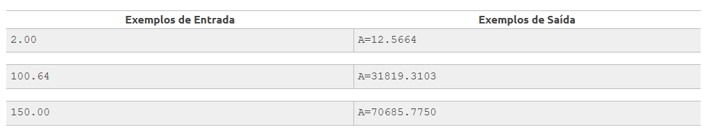

<h1>Área do Círculo</h1>

A fórmula para calcular a área de uma circunferência é: area = π . raio2. Considerando para este problema que π = 3.14159:

- Efetue o cálculo da área, elevando o valor de raio ao quadrado e multiplicando por π.

<b>Entrada</b> 
A entrada contém um valor de ponto flutuante (dupla precisão), no caso, a variável raio.

<b>Saída</b> 
Apresentar a mensagem "A=" seguido pelo valor da variável area, conforme exemplo abaixo, com 4 casas após o ponto decimal. Utilize variáveis de dupla precisão (double). Como todos os problemas, não esqueça de imprimir o fim de linha após o resultado, caso contrário, você receberá "Presentation Error".

