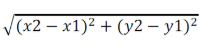
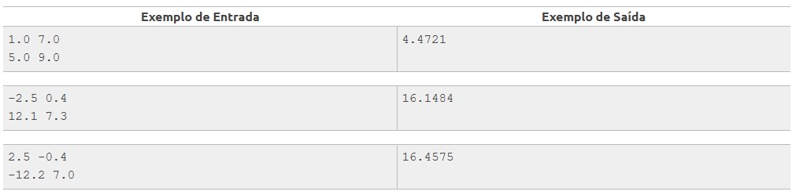

# Consumo
Leia os quatro valores correspondentes aos eixos x e y de dois pontos quaisquer no plano, p1(x1,y1) e p2(x2,y2) e calcule a distância entre eles, mostrando 4 casas decimais, segundo a fórmula:

Distancia = 

## Entrada
O arquivo de entrada contém duas linhas de dados. A primeira linha contém dois valores de ponto flutuante:**x1 y1** e a segunda linha contém dois valores de ponto flutuante **x2 y2**.

## Saída
Calcule e imprima o valor da distância segundo a fórmula fornecida, considerando 4 casas decimais.

